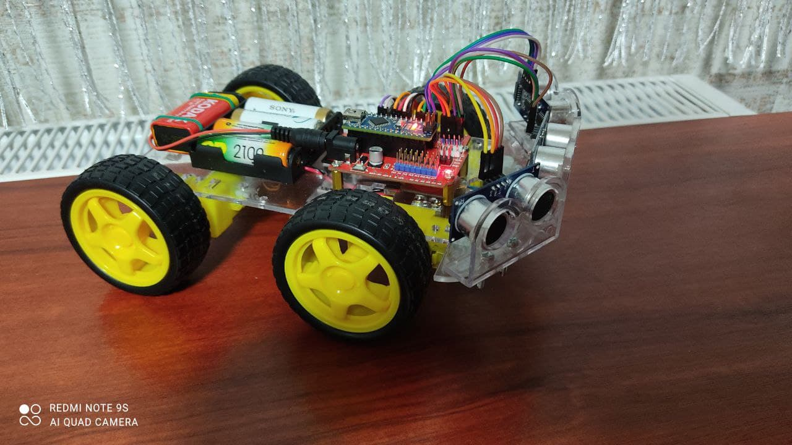
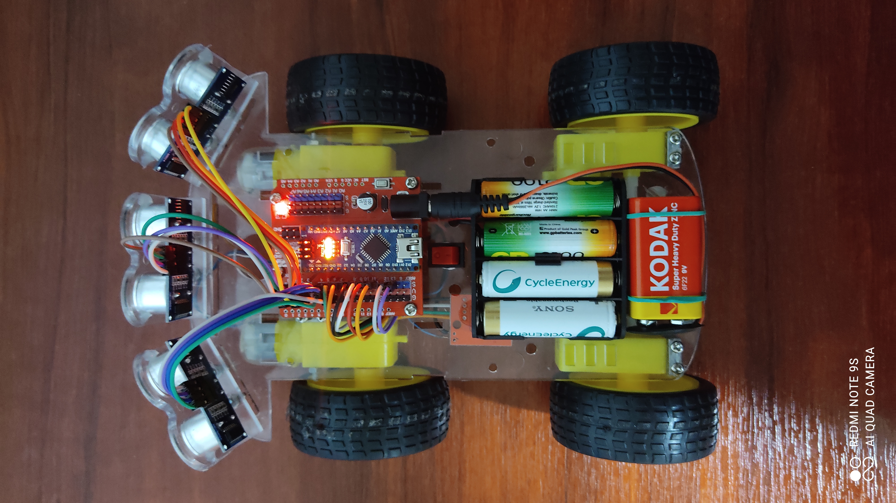
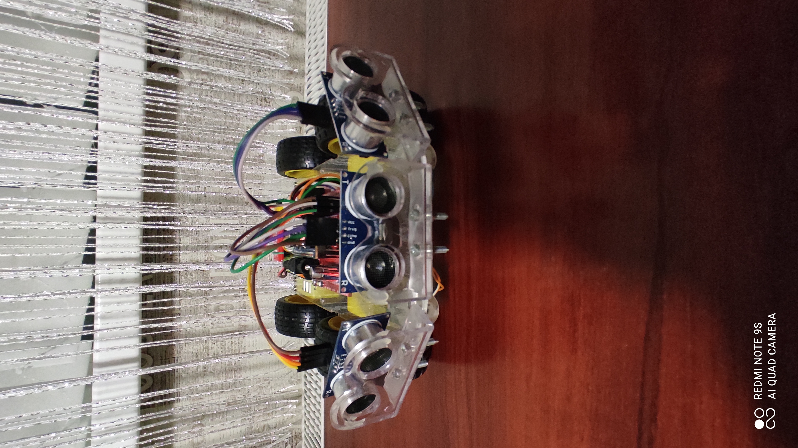
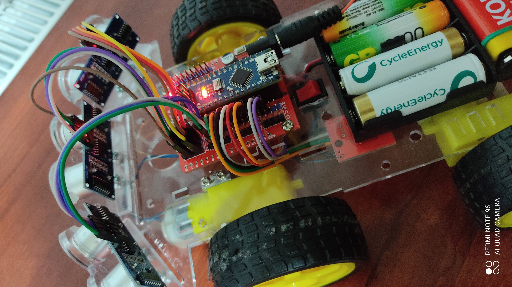
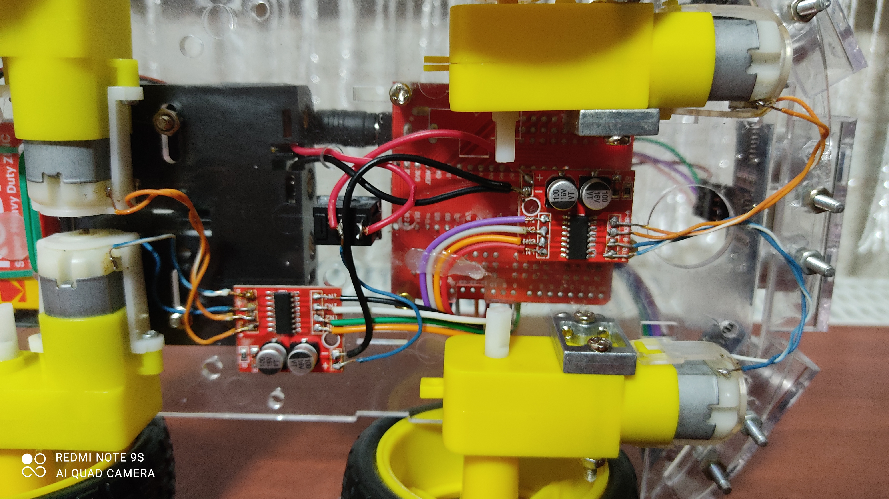

# 🤖 Mobile Wheeled Robot

**Autonomous obstacle-avoidance robot based on Arduino Nano (ATmega328P)**

---

## 📌 Overview

This project implements a fully functional autonomous mobile robot capable of detecting obstacles and dynamically adjusting its movement direction using ultrasonic sensors.

The robot continuously monitors distances in three directions and makes navigation decisions in real time using rule-based logic.

---

## 🧠 Hardware

* **MCU:** Arduino Nano (ATmega328P, 16 MHz)
* **Sensors:** 3× Ultrasonic distance sensors (HC-SR04 type)
* **Motor driver:** H-bridge driver module
* **Actuators:** DC geared motors
* **Platform:** Wheeled robotic chassis
* **Power supply:** Battery pack

---

## ⚙️ Firmware Architecture

The firmware is implemented using a polling-based architecture inside the main loop.

### Main structure:

```cpp
void loop() {
    cm_1 = f_1();  // front sensor
    cm_2 = f_2();  // left sensor
    cm_3 = f_3();  // right sensor

    Vpered();

    if(cm_1 < 15){
        Nazad();
        delay(500);
        Povorot_L();
        delay(500);
    }

    if(cm_2 < 22){
        Povorot_P();
        delay(400);
    }

    if(cm_3 < 20){
        Povorot_L();
        delay(400);
    }
}
```

---

## 📡 Distance Measurement

Each ultrasonic sensor is triggered individually to avoid interference.

Distance calculation:

```cpp
cm = (duration / 2) / 29.1;
```

This converts echo pulse duration into centimeters.

---

## 🔄 Navigation Logic

Default behavior: **Move forward**

Decision rules:

* Front obstacle (<15 cm) → Move backward + turn
* Left obstacle (<22 cm) → Turn right
* Right obstacle (<20 cm) → Turn left
* Combined conditions → Adjust direction accordingly

The robot uses rule-based obstacle avoidance without advanced path planning.

---

## 🔌 Motor Control

Movement modes implemented:

* `Vpered()` – Forward
* `Nazad()` – Backward
* `Povorot_L()` – Turn left
* `Povorot_P()` – Turn right

Control is performed via direct GPIO manipulation of the H-bridge inputs.

This version does not use:

* PWM speed control
* Interrupt-based timing
* RTOS

---

## 📸 Build Preview









---

## 🎥 Demonstration Video

[Watch demo video](https://youtube.com/shorts/Jzi-6pDRgFg?si=Qt6NGlyJSYMQF1j6)

---

## 🧩 Embedded Concepts Demonstrated

* Direct GPIO manipulation
* Ultrasonic sensor integration
* Real-time distance measurement
* Multi-sensor decision logic
* Motor control via H-bridge
* Full hardware–firmware integration

---

## 🔧 Engineering Improvements (Future Work)

* Replace blocking `pulseIn()` with timer-based measurement
* Remove `delay()` and implement non-blocking architecture
* Add PWM speed control
* Implement state-machine architecture
* Add PID-based stabilization
* Port firmware to STM32 platform

---

## 📚 Project Scope

This project demonstrates practical embedded development, combining:

* Microcontroller programming
* Sensor integration
* Actuator control
* Real hardware assembly
* Firmware debugging and testing
